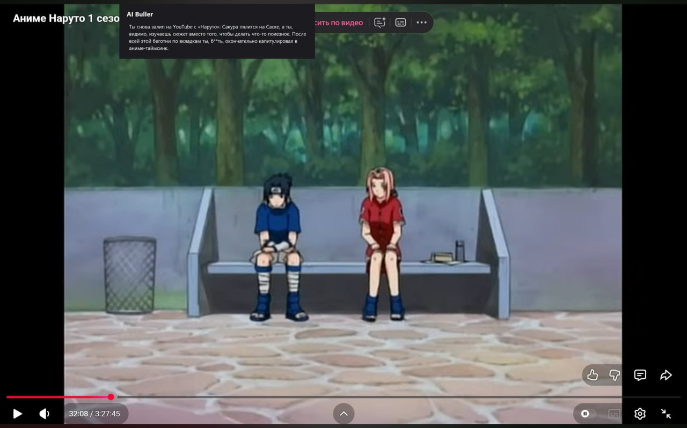
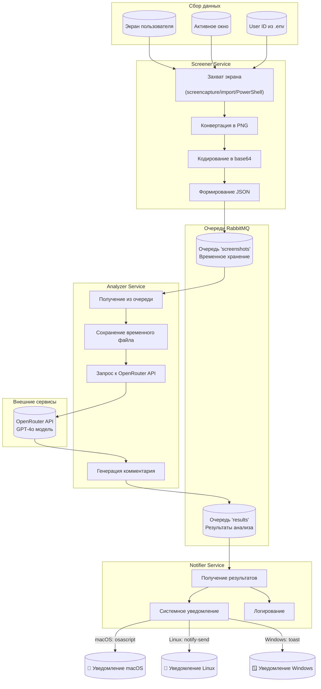

# AI Bully Agent

**AI-агент, который буллит тебя за непродуктивность** 

Сервис делает скриншоты экрана каждые 30 секунд, анализирует через OpenRouter (GPT-4o) и отправляет язвительные уведомления, если ты отвлекся на YouTube, игры или просто сидишь без дела.



<video src="./docs/demo.mp4" width="800" controls></video>

## Функционал MVP

1. **Автоматический сбор скриншотов** - каждые 30 секунд (настраивается)
2. **AI-анализ** - определение активности на экране через OpenRouter (GPT-4o)
3. **Системные уведомления** - язвительные комментарии в стиле "злого менеджера"
4. **Контекстный анализ** - учитывает последние 5 скриншотов для понимания динамики
5. **Кросс-платформенность** - работает на macOS, Linux и Windows

## Схема работы



## Технологический стек

| Компонент | Технология | Назначение |
|-----------|------------|------------|
| **Screener** | Go + RabbitMQ | Захват скриншотов, отправка в очередь |
| **Analyzer** | Python + OpenRouter | Анализ изображений через AI |
| **Notifier** | Go + beeep | Системные уведомления |
| **Брокер сообщений** | RabbitMQ | Асинхронная связь между сервисами |
| **Контейнеризация** | Docker, Docker Compose | Изоляция анализатора и RabbitMQ |

## Быстрый старт

### Предварительные требования

- **Docker** и Docker Compose (для RabbitMQ и анализатора)
- **Go** 1.21+ (для сборки screener и notifier)
- **OpenRouter API ключ** (получить на [openrouter.ai](https://openrouter.ai))

### Установка и запуск

1. **Клонируйте репозиторий:**
```bash
git clone <repository-url>
cd HSEHack2
```

2. **Настройте API ключ:**
   
   Отредактируйте файл `.env`:
```env
OPENROUTER_API_KEY=ваш_ключ_сюда
USER_ID=ваш_никнейм
CAPTURE_INTERVAL=30s  # интервал скриншотов
```

3. **Запустите проект:**

   **На macOS/Linux:**
```bash
chmod +x start.sh
./start.sh
```

   **На Windows:**
```cmd
start.bat
```

4. **Остановка проекта:**

   **На macOS/Linux:**
```bash
./stop.sh
```

   **На Windows:**
```cmd
stop.bat
```

### Проверка работы

После запуска вы увидите:
- Скриншоты в папке `screenshots/`
- Системные уведомления с комментариями от AI
- Логи в папке `logs/`
- Веб-интерфейс RabbitMQ: http://localhost:15672 (guest/guest)

## Структура проекта

```
HSEHack2/
├── 📄 .env                     # Конфигурация и API ключи
├── 📄 docker-compose.yml       # Оркестрация Docker контейнеров
├── 📄 start.sh / start.bat     # Скрипты запуска
├── 📄 stop.sh / stop.bat       # Скрипты остановки
├── 📄 .gitignore               # Игнорируемые файлы
│
├── 📁 services/                 # Микросервисы
│   ├── 📁 screener/            # Go сервис скриншотов
│   │   ├── 📄 main.go
│   │   └── 📄 go.mod
│   │
│   ├── 📁 analyzer/            # Python сервис анализа
│   │   ├── 📄 main.py
│   │   ├── 📄 requirements.txt
│   │   └── 📄 Dockerfile
│   │
│   └── 📁 notifier/            # Go сервис уведомлений
│       ├── 📄 main.go
│       └── 📄 go.mod
│
├── 📁 logs/                     # Логи сервисов
├── 📁 bin/                      # Скомпилированные бинарники
└── 📁 screenshots/              # Временные скриншоты
```

## Детали реализации

### Screener (Go)
- Определяет ОС и использует нативные инструменты:
  - **macOS**: `screencapture` + `osascript`
  - **Linux**: `import` (ImageMagick) + `xdotool`/`wmctrl`
  - **Windows**: PowerShell + .NET
- Отправляет base64 скриншотов в очередь `screenshots`

### Analyzer (Python)
- Получает скриншоты из RabbitMQ
- Сохраняет временные файлы в `/tmp/screenshots`
- Отправляет запрос в OpenRouter с контекстом последних 5 скриншотов
- Отправляет результат в очередь `results`

### Notifier (Go)
- Получает результаты из очереди `results`
- Показывает системные уведомления через `beeep`
- Кроссплатформенная поддержка уведомлений

## Docker контейнеры

```yaml
# Только analyzer и rabbitmq работают в Docker
services:
  rabbitmq:     # Брокер сообщений, порты 5672 и 15672
  analyzer:     # Python анализатор, зависит от rabbitmq
```

Screener и Notifier работают **напрямую на хосте** для доступа к экрану и уведомлениям ОС.

## Пример уведомления

```
AI Buller (Visual Studio Code)
О, опять в IDE сидишь? Хоть бы код писал, а не в документации читал! 
```

## Разработка

### Добавление новых функций

1. **Screener**: добавьте поддержку новых ОС в `services/screener/main.go`
2. **Analyzer**: улучшите промпт в `YOUR_PROMPT` в `services/analyzer/main.py`
3. **Notifier**: настройте внешний вид уведомлений

### Запуск в режиме разработки

```bash
# Терминал 1: Docker сервисы
docker-compose up -d

# Терминал 2: Screener
cd services/screener && go run main.go

# Терминал 3: Notifier  
cd services/notifier && go run main.go
```